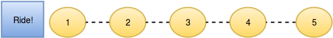
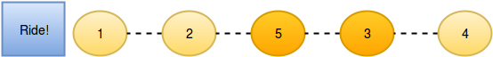

# New Year Chaos

It is New Year's Day and people are in line for the Wonderland rollercoaster ride. Each person wears a sticker indicating their initial position in the queue from  to . Any person can bribe the person directly in front of them to swap positions, but they still wear their original sticker. One person can bribe at most two others.

Determine the minimum number of bribes that took place to get to a given queue order. Print the number of bribes, or, if anyone has bribed more than two people, print Too chaotic.

## Example

q = [1, 2, 3, 5, 4, 6, 7, 8]
If person  5 bribes person 4, the queue will look like this: 1, 2, 3, 5, 4, 6, 7, 8. Only 1 bribe is required. Print 1.

q = [4, 1, 2, 3]
Person 4 had to bribe 3 people to get to the current position. Print `Too chaotic`.

## Function Description

Complete the function minimumBribes in the editor below.

minimumBribes has the following parameter(s):

int q[n]: the positions of the people after all bribes
Returns

No value is returned. Print the minimum number of bribes necessary or Too chaotic if someone has bribed more than  people.
Input Format

The first line contains an integer , the number of test cases.

Each of the next  pairs of lines are as follows:

- The first line contains an integer , the number of people in the queue
- The second line has  space-separated integers describing the final state of the queue.

## Constraints

## Subtasks

For  score
For  score

## Sample Input

|STDIN|Function|
|-----|       --------|
|2|           t = 2|
|5 |          n = 5|
|2 1 5 3 4|   q = [2, 1, 5, 3, 4]|
|5|           n = 5|
|2 5 1 3 4|   q = [2, 5, 1, 3, 4]|

## Sample Output

3
Too chaotic
Explanation

## Test Case 1

The initial state:

After person  moves one position ahead by bribing person :

Now person  moves another position ahead by bribing person :

And person  moves one position ahead by bribing person :

So the final state is  after three bribing operations.

## Test Case 2

No person can bribe more than two people, yet it appears person  has done so. It is not possible to achieve the input state.

## Test Case 3

The final state: [1, 2, 5, 3, 7, 8, 6, 4]

1. Initial state: [1, 2, 3, 4, 5, 6, 7, 8]
2. 5 bribes ahead of 3 and 4: [1, 2, 5, 3, 4, 6, 7, 8]
3. 7 bribes ahead of 4 and 6: [1, 2, 5, 3, 7, 4, 6, 8]
4. 8 bribes ahead of 4 and 6: [1, 2, 5, 3, 7, 8, 4, 6]
5. 6 bribes ahead of 4: [1, 2, 5, 3, 7, 8, 6, 4]

Total bribes: 2 + 2 + 2 + 1 = 7

## Note

- You only need to loop and check how many times that person got paid. (Total bribed == total paid)
- You cannot pay the person in front of you who already bribed you to get there.
- If you already got paid then you can only bribe once in the case where people behind you bribed you and the person in front of you AND you bribed the person in front of you. (eg. 3, 4, 2, 1)
  - This is the only case where someone can get paid while bribing others, without refunding the bribe to the same person who paid you.
  - You can be back to where you were when this happens. (eg. 3, 1, 2)
  - People behind you can only get ahead of you maximum 2 spots.
- You cannot be at the end of line after bribing someone because the person got paid to get behind you cannot bribe you again.
